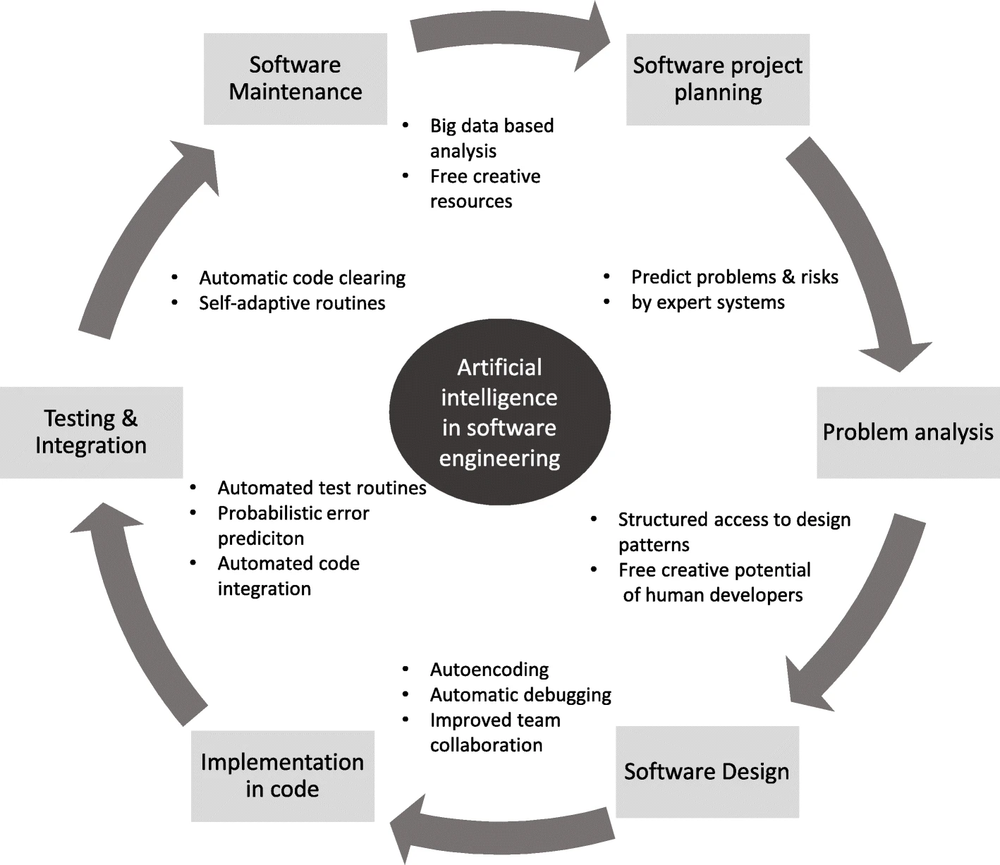

# **Wade Venz T1A1**

## Workbook

### _**Question 1: Identify and explain common and important components and concepts of web development markup languages**_

    When considering markup languages for web development, one of the most common markup languages is HTML or 'Hypertext Markup Language'. Basically, HTML enables data to be seperated into elements to make it easier to structure a webpage. These elements form the building blocks to be styled and designed to create an engaging experience for the user.
    
    There are other languages such as XML (eXtensible Markup language) or Markdown, however HTML appears to be the main markup language in web development (Lenovo, 2024). Components and elements are annotated by 'tags' which help organise and collate data, and assist in its styling as the structure and tags are easily referenced and understood (Britannica, 2024). Some example components or tags in HTML include, header, body, section, main or footer. These house text data to be styled and displayed. 

1 [Britannica] (<https://www.britannica.com/technology/markup-language>) -(Brtitannica, 2024)
2 [Lenovo] (<https://www.lenovo.com/au/outlet/en/glossary/markup-language/?orgRef=https%253A%252F%252Fwww.google.com%252F>) - (Lenovo, 2024)

### _**Question 2: Define the features of the following technologies that are essential in terms of the development of the internet:**_    - **_packets_**   - **_IP addresses (IPv4 and IPv6)_**   - **_routers and routing_**   - **_domains and DNS_**    **_Explain how each technology has contributed to the development of the internet._**

    Packets
        A packet is a compartmentalised section of data sent over a network, utilising a set of standards or protocols. By segmenting complete messages or data this way, enables more efficient transfers and some enhanced security. For example each packet can carry its own encryption, they are also able to take different pathways or routes to their final destination allowing them to travel the path of least resistence. 

        Packets are split into main parts, a header, which contains information including that of the sender and the recipient, the main part of the packet, and in some cases a signature or aka, trailer or footer. 

        https://www.techtarget.com/searchnetworking/definition/packet - (Yasar, 2022)
    
    IP addresses (IPv4 and IPv6)
        IP or 'Internet Protocol' are rules or standards mentioned above to facilitate transfer of packets over a network. IP addresses are  unique identifiers for each device. 
        The initial version of IP addresses or 'v4' was 32-bit addresses utilising a series of numbers and decimals. However that finite sequence of numbers has been outgrown with the vast popularity and widespread use of the internet over an ever growing number of devices. Therefore a larger library IP addresses is required, enter IPv6. Using a 128-bit address, integers and letters, the pool of possible unique addresses exponentially rises with some extra added benefits ....

        https://kinsta.com/blog/ipv4-vs-ipv6/ - (Duò, 2023)

    Routers and Routing
        For data or information to be sent or retrieved over a network, an appropriate path must be selected, that path is called its route. A router is essentially a bit of hardware connected to the network that decides the route that data packets will take to reach its destination. 
        When a router receives a data packet it will read its associated address and unique information to identify where the data needs to go. It will then utilise data it has for best pathways to take and send the data the most efficient route, this is called 'routing'(Fig. 1(Cloudfare, 2024)). When a pathway in a network has been set up by an admin and doesnt change, this is called 'static routing', however as networks grow, so does the amount of data being sent. Dynamic changes can be required to prevent blockages and delays, which can make 'dynamic routing' far more desirable.(AWS, 2024)
)
Fig. 1

 
    Domains and DNS
        Each and every accessible area on the internet needs identification or a website address, this is where Domain names or 'Domains' become useful. Generally organised into three main parts or levels (Singh, 2021), they help identify unique web addresses and seperate them from others. 

        These domains are collated into directories or systems which is called the DNS or 'Domain Name System'. As Domain names are more easily understood and memorised than IPs or long lists of numbers, the DNS matches a Domain to an IP address so humans and computers can communicate more efficiently together. The DNS is essentially the internets infrastructure and therefore vital for its usability.

        https://www.okta.com/au/blog/2021/03/what-is-a-domain-name-system-dns/ - (Singh, 2021)

### **_Question 3: Define the features of the following technologies that are essential in terms of the development of the internet:_**   - **_TCP_** - **_HTTP and HTTPS_** - **_web browsers (requests, rendering and developer tools)_**   **_Explain how each technology has contributed to the development of client and server communication over the internet (50 - 150 words for each technology)_**

    - TCP
        Data transmission is made possible by breaking down data into manageble pieces called 'packets' and sent to a target using an 'IP' as an address. While this may result in successful data transmission, the packets may not arrive in the correct order, and may appear meaningless. Essentially TCP or Transmission Control Protocol, works with IP to solve this. It keeps communication open between the source and the target so that when data has been transmitted it can arrange the data in the correct way so that is useful to the recipient. Communication is kept open via what is referred to as a "three-way handshake". Simply the source computer sends a 'SYN' or syncronisation, which is returned by the target with an 'ACK' or acknowledgemnt. The acknowledgement is then returned back from the soource computer, and actual data is transferred from the source being constantly acknowledged from recipient. The TCP then utilises the information embedded in packets, to then organise and deliever to the target as intended. 

        https://www.cloudflare.com/en-gb/learning/ddos/glossary/tcp-ip/ - (Cloudfare, 2024)

    https://www.khanacademy.org/computing/computers-and-internet/xcae6f4a7ff015e7d:the-internet/xcae6f4a7ff015e7d:transporting-packets/a/transmission-control-protocol--tcp

    - HTTP & HTTPS
        - HTTP stands for Hypertext Transfer Protocol and was the pioneering technology for communication over the internet. As the name protocol would suggest, it refers to the guidelines for sending and receiving data from a web server. When a user accesses a browser, HTTP sends a request to the web server, which then responds, enabling data transfer. However this data is in plaintext and is not secure from external parties, therefore a more secure method was devised, HTTPS or HTTP Secure. Rather than plaintext, data over HTTPS in encrypted. For communication from the browser and the server to occur, an SSL certificate (Vocell, 2022) must be issued and security keys are traded to encrypt the data and increasing security. 
        On top of security as an advantage to HTTPS, increased authority and performance are also benefits. Also due to HTTPS being more trusted, search engine results are optimised making secure sites a priority. 

<https://aws.amazon.com/compare/the-difference-between-https-and-http/> - (AWS, 2024)
<https://blog.hubspot.com/marketing/what-is-ssl> (Vocell, 2022)

    - Web Browsers
        A Web browser is simply software that enables a user to interact with websites on the internet. There has been numerous different web browsers since the genesis of the internet, however there are a few common popular ones currently being used including Google Chrome, Safari and Mozilla (Rouse, 2023). A user can navigate to websites via URLs or Uniform Resource Locators. URLs are basially addresses that enable users to navigate all over the internet to specific websites or 'resources'.

<https://www.techopedia.com/definition/288/web-browser> - (Rouse, 2023)

### **_Question 4: Describe the features of interpreters and compilers and how they are different._**

Source code written in high level programming languages makes it easier for a programmer to use and understand, however computers operate in binary or a low level language, therefore code needs to be converted for programs to be executed.

    Compilers convert source code to machine or (object) code before executing a program. The language only need to be compiled once, which is slower to initially analyse, however more efficient to run as the language has already been converted to machine code and doesn't need to persistently put load on the server. 

    Interpreters act a bit differntly as they directly convert and execute source code during program runttime. There is minimal initial analysis delay, however the program does run slower as the language is being converted at each line. 

    Compilers will identify errors and bugs as the code is compiled, and errors are required to be fixed prior to compilation being completed. 
    Interpreters will find and notify of errors in code as they are identified as each line is being executed. 

    Finally, programming languages can contain both functions as compiled languages contain interpreter implementations and interpreters dont nullify the need for compilers. The merging features of compilers and interpreters can be seen in languages such as Javascript which will be described below. 

<https://builtin.com/software-engineering-perspectives/compiler-vs-interpreter> - (Sassi, 2023)
https://www.baeldung.com/cs/compiled-vs-interpreted-languages (baeldung, 2024)

### **_Question 5: Identify TWO commonly used programming languages and explain the benefits and drawbacks of each._**

    - Javascript
    As of last year, Javascript was the most popular programming language (Logan, 2023). Javascript historically has been known as an interpreted language that over time developed methods to operate with the benefits of compilers. JIT or Just in Time compilation, which essentially converts source code into machine code at point of execution, will only convert that code necessary for function. This reduces the load and increases speed and efficiency. (FreeCodeCamp, 2020). Javascripts popularity can also be attributed to its wide versatilty and access to numerous libraries and environments such as React and Angular. These create widespread platform accessibilty and use, both front and back end (Neville, 2023). 
    Although Javascript does have sercurity protocols and redundancies built-in, especially into the compatible frameworks, the client side nature of Javascript makes it vulnerable to implanted malicious code, and if not used properly a user can be exposed to leaks of sensitive data. Also it is necessary to run multiple tests on multiple different browsers as Javascript does not always run consistently across browsers. Also compared to compiled languages, Javascript can lower on speed and also debugging efficiency as the tools used are not advanced as some other languages. Overall however Javascript is a powerful high level language that is widely used and has enabled a vast majority of browsers and apps that are used today (Nevilles, 2023).

    https://www.freecodecamp.org/news/just-in-time-compilation-explained/ (FreeCodeCamp ,2020)
    https://softjourn.com/insights/the-advantages-and-disadvantages-of-javascript - (Neville, 2023)
    https://www.devjobsscanner.com/blog/top-8-most-demanded-programming-languages/ (Logan, 2023)

    - Python
    Taking the second most popular language spot was Python (Logan, 2023). The high level nature of this language (closely resembling written English), makes it an easy introduction to programming and enables programmers fast learning with a wide support network. Its uses are expansive, like Javascript, it has access to many libraries such as Flask, which enable the ability to build apps and web pages. The code is also adaptable and embeddable, meaning it works well wiht other coding languages and databases such as SQL (Gavrilova, 2023). However as Python is an interpreted language it does come at the cost of slower processing speeds than its compiled counterparts. Also with the increased flexiblity of Python can come increased drawbacks. Like Javascript, Pythons popularity leaves it vulnerable to malicious attack if not used properly, and although it has in built security features, its code analysis at runtime can leave malicious code into program at a late stage. This also leads into some debugging issues especially at high density projects. The versatility and high level of the Python language can also lead to frustrating type errors that would be identified earlier in other languages, increasing debugging time and slowing down development (Gavrilova, 2023). Overall however, it would seem that Pythons broad access and ease of its use combined with its wide capabilities overcome its limitations and contribute to its massive popularity. 

The languages above share a lot of similarities as they are both popular, dynamically typed, high level languages. They share widespread use in a vast amount of browser and applications. And while they share a number of aspects, the frameworks and environments they associate with lend each language to be utilised in different ways. Javascripts frameworks enable a lot of visual components and aspects leaning it more to front end application, where python language functionailty and use will see it moreso applied in the back end.  

<https://serokell.io/blog/python-pros-and-cons> - (Gavrilova, 2023)
  
### **_Question 6: A hypothetical client has sent you an email, asking for you to build them a website. Write an appropriate, professional email response that shows your understanding of the client’s needs for the website, as well as an understanding of appropriate technologies or tools needed to build the website yourself._**

<!-- Hello there!

My name is Alex, and I’m the director of the Super Awesome Museum (SAM). We display a variety of interesting artefacts, objects, and paraphernalia about all sorts of things from all over the world.

I’m writing to you because the SAM needs a website. The museum is new in the city, we’re fully funded and don’t sell our items but we just need to encourage people to visit the museum.

We would need a website that showcases some of our interesting exhibits and items, helps people find their way to the museum, and helps people contact the museum.

We don’t know much about this website stuff - does this sound like something that you can do? 

Looking forward to hearing from you,

Alex

Director

Super Awesome Museum   -->

Hi Alex,

I'm Wade, thanks for reaching out to the Super Awesome Development Company for assistance with your new website build. This sounds like an exciting project and I'd love to hear more!

From what I understand, you have three objectives:
    1. Create a website that attracts prospective visitors of all ages by displaying some of your interesting exhibits in a formate that generates interest and is easy to navigate
    2. Help prospetive visitors easily find their way to your museum with simple instructions, a map and important information (opening times, public transport, parking, etc.)
    3. Make it easy to contact the museum via multiple methods.

Did I miss anything?

To achieve these objectives, I propose we create a small (4 page) website. As the website does not require any complex functionality the entirety of the website can be completed utilising a simple stack of HTML5 and CSS with small touches from Javascript for some user interface aspects. The pages I think would suit include:
    - A visually engaging homepage with a carousel of major current exhibits.
    - An 'About' page with a brief synopsis of the museum 
    - An FAQs page with important information about the exhibits, getting to the museum and how different groups can get in touch with the right person (e.g. Partnerships, Events, School Tours).
    - A 'Contact' page with general contact information, a responsive 'Contact Form' with recaptcha validation that would send form submissions to an email of your choice.

How does this sound? We can deploy the site as per your preference — I tend to use GitHub pages. 

If you're happy to proceed, let's set up a meeting to discuss the functionality I've discussed. I'll be able to provide you with a quote and timeline for you to review.

Looking forward to hearing from you,

Wade
Dev, SADC

### **_Question 7: Think back to a scenario or situation in your own software development projects or work. Explain how you would do things differently if you had a chance to go through that scenario again, using an appropriate reflective cycle or reflection technique._**

Description

As my journey in software development is new and extremely brief, I have very minimal experiences to reflect upon. However having recently completed a Portfolio website, I have fresh insight into a specific project. The project was to create a simple Portfolio website to present myself in a professional manner, giving a target audience a brief insight into my personality and professional aspirations. 

Eager to get started, I began wireframing the site in Figma without carefully thinking about what I was trying to achieve, the content that I wanted to present, or the best functionality to complement each page. Once I'd hastily mocked up a nice looking site, I started building. It was only at this point that I realised that I hadn't spent enough time thinking things through and now I would need to start over. I'm going to use the ERA Reflective cycle to reflect on this situation in more detail.

Experience
This situation happened a couple of weeks into my first ever software project. Overall, building the site was a really positive experience, but I really learned a lot in this particular part of the project. 

Because I'd never built a portfolio website before, I had researched other professional portfolios in order to gain insight into what I thought would look good and serve me well once I graduated from Coder Academy. This process also helped me to determine what I didn't like. However, it also resulted in a Frankenstein planning process, where I simply gained inspiration from others, rather than properly thinking through what would truly work for me.

Unfortunately it wasn't until I was deep into the development part of the process where I realised that this approach wasn't the best, and that I would need to backtrack in order to build the best site for my future career.

Reflection

In the initial stages I felt very eager to get started with code. Most likely due to anxiety over time limitations and the sense of scale I had created in my mind over the project. I admit I had felt overwhelmed and therefore did not spend enough time in the planning phases. I believe I underestimated the function of processes such as sitemaps and wireframes and there role in a completed website.

Once I reached the point where I had to start again, I felt deflated. I had built a number of 'complex' functionalities (well at least for beginner me), including a blog post carousel and a burger menu for mobile, and I realised they weren't the best solutions for my site. Incomplete planning and changes to the design also caused me to feel a lot of indecision and confusion in later parts of the project.

Once I decided to stop coding, and take some time to plan, I started to feel a lot more clarity about the project. I replaced the 'rubber duck' with my wife who helped me to understand my priorities and then create a solution that worked towards these goals.

Action

It's well known that good planning prevents poor outcomes, and this has certainly been the case for me!

I have a lot of learnings from this scenario. Next time I have a similar project, I'm going to:
1. Get clear on my goals for the website.
2. Develop a plan that will achieve these goals
3. Determine the layout, user experience and functionality needed
4. Create a wireframe that demonstrates how the site will look, with notes that explain the functionality
5. Once I'm happy, THEN I'll start coding!
6. Be generous with commenting and pseudocode to help visually represent ongoing thought processes and desired outcomes.

Spending time on complete planning, and having a comprehensive knowldege of expectations and processes to achieve will not only improve time managment and efficiency but also prevent anxiety and a feeling of being overwhelmed.

On top of this, a frequent review and update of processes utilising tools such as a kan ban board will aid in future projects to compartmentalise larger projects into smaller and more manageable pieces.

### **_Question 8: A large part of career growth as an information technology professional happens through networking and workshops, often found at online or in-person events or workshops.     Create an action plan that identifies several relevant networking opportunities for you to participate in or attend, and add some information about what you expect to gain or grow through each item in the action plan._**

Within the following events or opportunitues is a brief description and expected outcomes and goals for each. The list encompasses a plan of action for present and future networking in pursuing a career in IT. 

1. Attend The Design Conference (June 2024) - This conference is attended by Australia's best design teams, both in-house and agency side. I hope to gain a deeper understanding of the design world, and exactly what design teams need from good developers and how we can work synergistically together. In my experience the best developers work hand-in-hand with design teams to create websites, apps and programs that are not only functional but have an additional focus on the user experience and design of the product as well.  The Design Conference also has a specific focus on creating networking opportunities, and I plan on making the most of them. Ideally, I will meet my future employer, or someone who can introduce me to them.

2. Join a hackathon (or mini hackethon) - Hackathons are designed for community engagement to spark innovation and creativity for people with similar interests and aspirations. Working together with people on a software project towards achieving solutions and often solving real world issues is a great way to both meet and engage with a multitude of people from the industry all the while gaining invaluable experience and knowledge. These events can happen in person, or online. Advertisements for these can come via sites like [Hackathons Australia](https://www.hackathonsaustralia.com/) or [Hackathons](https://www.hackathons.com.au/.com) which display global events. While already passed, a mini hackathon like the one put on by [IXDA](https://events.humanitix.com/ixda-brisbane-mini-hackathon-march-2024) would be a great event to be on the lookout for recurring.

3. Join or contribute to an open source project (ASAP) - One of the ways it is said to learn to code is to... code. Open Source projects allow real world application to everyone from beginners to advanced people to get a feel for and understand coding. My plan is to as soon as possible, find a suitable Open Source profect, for example utilising GitHub or peruse around Mozilla, and take a shot at contributing some code or experiencing some techniques utilised in the software development industry. By getting real hands on experience not only do I hope to engage with other developers of like mindedness I hope to advance my own skills and knowledge in preparing for employment. These projects are saturated full of knowledge and experience and people that are willing to share collaborate on ideas. 

4. Online networking/ skill development resources (Ongoing) - [Just Digital People](https://www.justdigitalpeople.com.au/), [hackster.io](https://www.hackster.io/)

5. Meeting with industry professionals (Ongoing) - Through immediate contacts with people I know who work in or adjacent to the tech or software industry, I have planned and continue hope to organise meetings and create ongoing relationships. Through these contacts I hope to gain valuable insight into skills and expereince required to be employed in the field. The plan includes onging exposure to people and contacts that are in the fields I desire to be apart, and with knowledge gained, create avenues of employment and also advice how to achieve persisting development and upskilling. 

### **_Question 9: Explain the uses of language-learning model technologies (such as ChatGPT) on written and technical works, such as reports and software projects._**

Able to analyse large amounts of data quickly imporving efficiency and uses in predominantly tasks that can be automated. Simple code and routines are able to be replaced by AI. 
It also has the ability to help analyse and solve problems in software. 

Its limitations, at least perceived currently lie in its inability for creative thought. Human ingenuity and innovation are still required. 

Fig. 2

https://link.springer.com/article/10.1186/s42467-020-00005-4 (Barenkamp, Rebstadt & Thomas, 2020)
https://elearningindustry.com/successful-leadership-practices-in-the-era-of-ai-as-a-learning-technology-strategist
https://www.intellectsoft.net/blog/benefits-and-perspectives-of-artificial-intelligence-in-software-development/

### **_Question 10: Explain the legal and ethical impacts of the usage of language-learning model technologies (such as ChatGPT) in written and technical works, such as reports and software projects._**

https://www.walkme.com/blog/ai-legal-issues/#:~:text=Examples%20of%20AI%20legal%20issues,Large%20fines.
https://jidc.org/index.php/journal/article/view/37824352/3172
https://www.sciencedirect.com/science/article/pii/S2666659620300056
https://remotebase.com/blog/chat-gpt-for-software-development-and-its-ethical-concerns-1

### **_Question 11: Explain multiple skills from each of the categories below, and how they’re useful to a software development workplace.    - soft skills   - hard skills_**

- Soft Skills
  - Communication
    Communication is vital in a team environment as the ability to receive instruction and data and relay clear and understandable information is fundamental to collaboration.

  - Problem Solving
  It is no secret that one of the fundamental soft skills in software development is problem solving. Developing software is the task of being presented with a problem and coming up with a solution

  - Time Management

  - Adabtability

- Hard Skills
  - Programming languages
    Having an understanding and experience in the programming languages required to build the software required. This will generally entail multiple languages, which is skill that
  - Full stack capability
  - Cloud and cloud security
  - DevOps
  - Agile
  - Algorithm
  - Testing and Debugging

### **_Question 12: Explain multiple roles or job positions that would be found in a medium-sized software development company._**

- Project Manager
    A project manager is responsible for understanding client requirements, assembling a team, setting milestones and deliverables, keeping a project moving and on track and then reporting back to clients. They will also evaluate and reflect at project completion.

- UX/UI designer
    Creates designs that are optimised for user interaction based on research, user testing and best practice princples. 

- Software Architect

- Software Developer
    Tasked with building the software with hard coding skills. in collaboration with a full team, will plan, build, test and implement code to client needs and specification. 

- DevOps engineer

### REFERENCES

#### Question 1

1 [Britannica] (<https://www.britannica.com/technology/markup-language>)
2 [Lenovo] (<https://www.lenovo.com/au/outlet/en/glossary/markup-language/?orgRef=https%253A%252F%252Fwww.google.com%252F>)

#### Question 2

1 <https://www.techtarget.com/searchnetworking/definition/packet>
2 <https://kinsta.com/blog/ipv4-vs-ipv6/>
3 <https://www.cloudflare.com/en-gb/learning/network-layer/what-is-routing/>

  <https://cf-assets.www.cloudflare.com/slt3lc6tev37/5biqo5wm6nM8GSmiNyiAnl/b6b5c9befeda6ba99b4380d84953de18/routing-diagram.svg>

  <https://aws.amazon.com/what-is/routing/>
  
4 <https://www.okta.com/au/blog/2021/03/what-is-a-domain-name-system-dns/>

#### Question 3

1 <https://www.cloudflare.com/en-gb/learning/ddos/glossary/tcp-ip/> - (Cloudfare, 2024)
2 <https://aws.amazon.com/compare/the-difference-between-https-and-http/>
3 <https://www.techopedia.com/definition/288/web-browser>

#### Question 4

<https://builtin.com/software-engineering-perspectives/compiler-vs-interpreter>

#### Question 5

    https://www.freecodecamp.org/news/just-in-time-compilation-explained/
   https://www.devjobsscanner.com/blog/top-8-most-demanded-programming-languages/ (Logan, 2023)
1 <https://softjourn.com/insights/the-advantages-and-disadvantages-of-javascript> - (Neville, 2023)
2 <https://serokell.io/blog/python-pros-and-cons>

#### Question 6

#### Question 7

#### Question 8

#### Question 9

https://link.springer.com/article/10.1186/s42467-020-00005-4
https://elearningindustry.com/successful-leadership-practices-in-the-era-of-ai-as-a-learning-technology-strategist
https://www.intellectsoft.net/blog/benefits-and-perspectives-of-artificial-intelligence-in-software-development/

#### Question 10

https://www.walkme.com/blog/ai-legal-issues/#:~:text=Examples%20of%20AI%20legal%20issues,Large%20fines.
https://jidc.org/index.php/journal/article/view/37824352/3172
https://www.sciencedirect.com/science/article/pii/S2666659620300056
https://remotebase.com/blog/chat-gpt-for-software-development-and-its-ethical-concerns-1

#### Question 11

#### Question 12

Wade Venz, 15494
